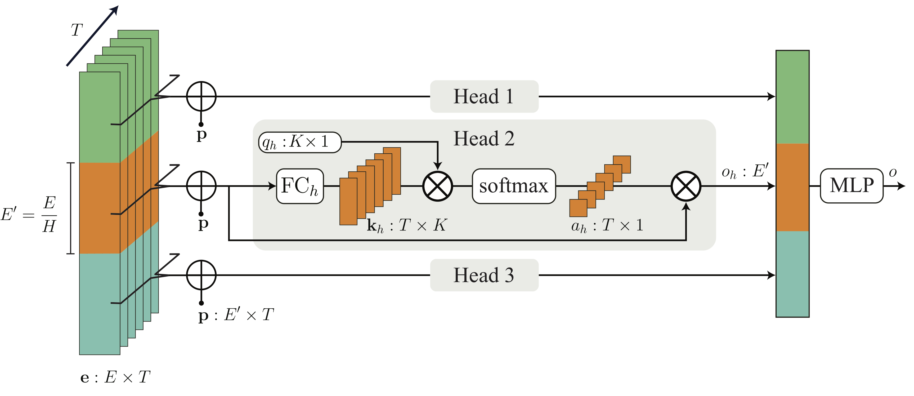
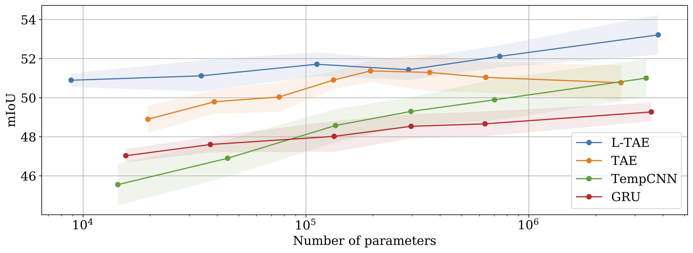

# Lightweight Temporal Self-Attention (PyTorch)
A PyTorch implementation of the Light Temporal Attention Encoder (L-TAE) for satellite image time series classification.
(see [preprint here](https://arxiv.org/abs/2007.00586))



*The increasing accessibility and precision of Earth observation satellite data offers considerable opportunities for industrial and state actors alike. This calls however for efficient methods able to process time-series on a global scale.
Building on recent work employing multi-headed self-attention mechanisms to classify remote sensing time sequences, we propose a modification of the Temporal Attention Encoder.
In our network, the channels of the temporal inputs are distributed among several compact attention heads operating in parallel. Each head extracts highly-specialized temporal features which are in turn concatenated into a single representation.
Our approach outperforms other state-of-the-art time series classification algorithms on an open-access satellite image dataset, while using significantly fewer parameters and with a reduced computational complexity.*

(see [preprint here](https://arxiv.org/abs/2007.00586))

## Requirements
 - PyTorch + Torchnet
 - Numpy + Scipy + scikit-learn 
 
 (see `requirements.txt`)
 
 The code was developed in python 3.6.10 with pytorch 1.5.0

## Downloads

### Sentinel-Agri dataset 

We use the Sentinel-Agri dataset available on this [github repository](https://github.com/VSainteuf/pytorch-psetae).
The dataset is comprised of time series of satellite images of agricultural parcels. Check the "Data Format" section 
of the [repository](https://github.com/VSainteuf/pytorch-psetae)  for more details on the data.

### Pre-trained weights

Pre-trained weights of the PSE+LTAE model available [here](https://zenodo.org/record/3929717#.Xv9lmZMzbOQ)

Use the `models.stclassifier.PseLTae_pretrained` class to instanciate the pre-trained model.

## Code

This repo contains all the necessary scripts to reproduce the figure below. 
The implementations of the L-TAE, TAE, GRU and TempCNN temporal modules can be found in `models`. 
These four modules are combined with a Pixel-Set Encoder to form a spatio-temporal classifier, directly applicable on the Sentinel-Agri PixelSet dataset. 
The four architectures are found in `models.stclassifier`.

Use the `train.py` script to train the 150k-parameter L-TAE based classifier (by default). 
You will only need to specify the path to the dataset folder:

`python train.py --dataset_folder path_to_sentinel-agri_pixelset_dataset`

You can use the same script to play around with the model's hyperparameters, or train an instance of a competing architecture.





## Credits

- The Lightweight Temporal Attention Encoder is heavily inspired by the works of Vaswani et al. on the Transformer, and this pytorch implementation served as code base for the ltae.py script.
- Credits to github.com/clcarwin/ for the pytorch implementation of the focal loss


## Reference


Please include a citation to the following paper if you use the L-TAE.


```
@article{garnot2020ltae,
  title={Lightweight Temporal Self-Attention  for Classifying Satellite Images Time Series},
  author={Sainte Fare Garnot, Vivien  and Landrieu, Loic},
  journal={arXiv preprint arXiv:2007.00586},
  year={2020}
}

```

Make sure to also include a citation to the PSE+TAE paper below if you are using the Pixel-Set Encoder.

```
@article{garnot2020psetae,
  title={Satellite Image Time Series Classification with Pixel-Set Encoders and Temporal Self-Attention},
  author={Sainte Fare Garnot, Vivien  and Landrieu, Loic and Giordano, Sebastien and Chehata, Nesrine},
  journal={CVPR},
  year={2020}
}

```